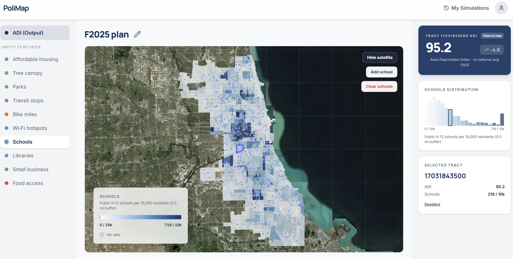

# PoliMap


Chicago census-tract choropleth with ten infrastructure / equity layers, baseline **Area Deprivation Index (ADI)** from tract-level data, and a policy simulator (draw bike routes, adjust parks, place schools/libraries). The simulator can call a Python service to **recompute tract features** and **predict ADI** from a trained model (`server/model.pkl` when present).

## Quick start

**Prerequisites:** Node.js 18+, Python 3.10+ (for data pipeline and optional API).

```bash
npm install
npm run dev
```

The Vite dev server defaults to port **3000** (see `package.json`). Sign-in and saved simulations use **Supabase**; copy `.env.example` to `.env` and set `VITE_SUPABASE_URL` and `VITE_SUPABASE_ANON_KEY` for full auth flows.

## Authentication (Supabase)

PoliMap uses **Supabase Auth** (email + password) to gate the simulator and persist per-user simulations.

- **Client:** `src/lib/supabaseClient.ts` calls `createClient(VITE_SUPABASE_URL, VITE_SUPABASE_ANON_KEY)`. Both env vars are **required** at build time — the client throws if either is missing.
- **Auth provider:** `src/auth/AuthProvider.tsx` wraps the app, hydrates the session via `supabase.auth.getSession()`, and subscribes to `onAuthStateChange`. It exposes `signIn`, `signUp` (writes a `display_name` into both user metadata and a `public.profiles` row when the new sign-up returns a session), and `signOut`.
- **Auth UI:** `src/AuthPage.tsx` (`/auth`) renders the combined sign-in / sign-up form with a `redirectTo` param so protected links return to where the user came from.
- **Route guard:** `ProtectedRoute` in `src/App.tsx` redirects unauthenticated users from `/simulator`, `/my-simulations`, and `/profile` to `/auth?redirectTo=…`.
- **Schema:** Migrations in `supabase/migrations/` create `public.profiles` (1-to-1 with `auth.users`), `public.simulations`, `public.simulation_geometry`, and `public.simulation_features`, each tied to `auth.users(id)` with row-level security so users only see their own rows.

### Setup

1. Create a Supabase project and copy the project URL + anon key into `.env`:

   ```env
   VITE_SUPABASE_URL=https://YOUR_PROJECT.supabase.co
   VITE_SUPABASE_ANON_KEY=your-anon-key
   ```

2. Apply the SQL migrations under `supabase/migrations/` (Supabase CLI `supabase db push`, or paste them into the SQL editor in dashboard order).
3. In **Authentication → Providers**, enable **Email**. If you don't want a confirmation step during development, disable "Confirm email"; otherwise new sign-ups will see "Account created. Check your email if confirmation is enabled."
4. The optional Flask API also reads `SUPABASE_SERVICE_ROLE_KEY` from `.env` for server-side actions; keep that secret out of the frontend.

**Optional — live recalculation API** (used when configured in the app):

```bash
pip install -r server/requirements.txt
# from repo root, with model + CSV in place
python -m uvicorn server.app:app --reload
```

## Data pipeline

The main end-to-end builder is **`scripts/build_features.py`**. It expects these to already exist:

| Prerequisite | Role |
|--------------|------|
| `inputs_processed/census_data_out.csv` | ACS-style tract rows (`GEO_ID`); defines which Cook County tracts are candidates before the Chicago filter |
| `inputs_processed/Business_Licenses_20260415_with_tracts.csv` | Geocoded active-license rows for small business and food access |

Install Python dependencies, then run:

```bash
pip install -r scripts/requirements.txt
python scripts/build_features.py
```

### Outputs (from `build_features.py`)

| Output | Description |
|--------|-------------|
| `inputs_processed/all_tract_features.csv` | **791** tracts × 10 feature columns + `Tract_Area_SqMi` + `Population` (all density-scaled per script rules) |
| `public/all_tract_features.csv` | Same write as above for the static dev server |
| `inputs_processed/combined_all_features.csv` | Feature columns merged with `census_data_out.csv` (wider ACS-style table) |
| `inputs_processed/chicago_tract_list.csv` | Sorted list of included `census_tract` IDs |
| `public/census_tracts.json` | Tract polygons (GeoJSON, WGS84) for the map |

**ADI column:** `build_features.py` does **not** add `adi`. The repository’s `public/all_tract_features.csv` includes a merged **`adi`** column for the default ADI choropleth; after regenerating features, merge baseline ADI from your source (e.g. `data/adi.csv`) if the simulator needs it.

**Other scripts** (maintenance / one-offs): `scripts/recalculate_all_features.py`, `scripts/combine_processed_features.py`, `scripts/assign_points_to_tracts.py`, `scripts/compute_bike_lane_miles_by_tract.py`, etc. The **canonical** bike-mile logic for the shipped pipeline is inside `build_features.py` (see below).

**Map bike overlays:** The UI loads `public/bike_routes.geojson` and `public/bike_trails.geojson`. Regenerate or refresh these from `inputs_raw` as needed (e.g. `inputs_raw/csvtojson.py` for routes from the City CSV).

## Tract selection

1. Load **2025 Census cartographic boundary** tracts: `IL_tracts/cb_2025_17_tract_500k.shp`, Cook County (`COUNTYFP == "031"`).
2. Keep tracts whose `GEOID` (as `census_tract`) appears in `census_data_out.csv`.
3. **Chicago footprint:** tract intersects a Chicago CTA bus stop (`CTA_BusStops.zip`, `CITY == CHICAGO`) **or** tract centroid lies inside a **0.5-mile** buffer (2,640 ft in projected CRS) around the **convex hull** of those stops.
4. Always include **`17031840000`** (explicit allowlist).
5. Remove **`17031760900`, `17031770600`, `17031770700`, `17031000000`**.
6. Remove tracts whose **six-digit tract suffix** (characters 5–10 of the 11-character GEOID) falls in **805600–822900** (western suburban band without raw-data coverage).
7. Remove **`17031030702`** and **`17031980100`** (documented small-area / outlier drops).

Final tract count: **791**.

## Feature calculations

All buffered distances and lengths use **EPSG:3435** (NAD83 Illinois East, US feet). Raw counts are joined or intersected in projected space, then converted to **densities** (per sq mi, per 1k population with a floor of **500**, or per 10k where noted).

### Tree canopy (`Tree_Canopy`)

- **Unit:** Percent canopy cover (0–100 scale from source).
- **Source:** `inputs_raw/tree_canopy.geojson` (`PCT_Tree`, `FIPS`).
- **Method:** FIPS match → parent-tract `…XX` → `…00` fallback → area-weighted overlay of canopy polygons on tract geometry for remaining gaps → fill NaN with 0.
- **Normalization:** None (already a percentage).

### Affordable housing (`Affordable_Housing`)

- **Unit:** Subsidized / income-restricted **units per 1,000 residents** (population floor 500).
- **Source:** `inputs_raw/Affordable_Rental_Housing_Developments_20260415.csv` (`Latitude`, `Longitude`, `Units`).
- **Method:** Points joined to tracts buffered by **0.5 mi**; `Units` summed (a site can count toward multiple tracts).
- **Normalization:** Sum ÷ (`Population` / 1000, clipped at 500).

### Parks (`Parks`)

- **Unit:** Park **acres per square mile** of tract area.
- **Source:** `inputs_raw/CPD_Parks_20260416.csv` (`the_geom` WKT).
- **Method:** Park polygons intersected with tracts buffered by **0.25 mi**; intersection areas summed as acres.
- **Normalization:** Acres ÷ tract area (sq mi).

### Transit stops (`Transit_Stop`)

- **Unit:** **CTA bus + Metra** stops **per 10,000 residents** (population floor 500).
- **Sources:** `inputs_raw/CTA_BusStops.zip` (`CITY == CHICAGO`), `inputs_raw/Metra_Stations.zip` (Chicago via `MUNICIPALI`).
- **Method:** Point-in-tract spatial join on **unbuffered** tract polygons (`intersects`); CTA and Metra counts added per tract.
- **Normalization:** Count ÷ (`Population` / 1000), then × **10** for per-10k display.

### Bike miles (`Bike_Miles`)

- **Unit:** On-street + off-street **lane miles per square mile** of tract area (after **0.25 mi** tract buffer used for intersection length).
- **On-street source:** `inputs_raw/Bike_Routes_20260415.csv` — rows where `DISPLAYROU` (trimmed) is one of **`Protected Bike Lane`**, **`Buffered Bike Lane`**, **`Greenway`** (WKT in `the_geom`).
- **Off-street source:** `inputs_raw/Off-Street_Bike_Trails.geojson` — **all** line geometries are merged in this pipeline (no Chicago-only / status filter here).
- **Method:** Combined lines intersected with **0.25 mi** buffered tracts; clipped segment lengths summed in feet → miles per tract.
- **Normalization:** Miles ÷ tract area (sq mi).

### Wi‑Fi hotspots (`Wifi_Hotspots`)

- **Unit:** Count **per square mile** of tract area.
- **Source:** `inputs_raw/Connect_Chicago_Locations_-_Historical_20260416.csv`.
- **Method:** Points joined to tracts buffered by **0.5 mi**.
- **Normalization:** Count ÷ tract area (sq mi).

### School density (`School_Density`)

- **Unit:** CPS points **per 10,000 residents** (floor 500).
- **Source:** `inputs_raw/Chicago_Public_Schools_-_School_Profile_Information_SY2425.csv` (`School_Latitude`, `School_Longitude`).
- **Method:** Points joined to tracts buffered by **0.5 mi**.
- **Normalization:** Count ÷ (`Population` / 1000), then × 10.

### Library count (`Library_Count`)

- **Unit:** Library points **per 10,000 residents** (floor 500).
- **Source:** `inputs_raw/Libraries_-_Locations,_Contact_Information,_and_Usual_Hours_of_Operation_20260415.csv` — coordinates parsed from the `LOCATION` field `(lat, lon)`.
- **Method:** Points joined to tracts buffered by **1.0 mi**.
- **Normalization:** Count ÷ (`Population` / 1000), then × 10.

### Small business (`Small_Business`)

- **Unit:** Active licenses **per 1,000 residents** (floor 500).
- **Source:** `inputs_processed/Business_Licenses_20260415_with_tracts.csv` — `LICENSE STATUS` normalized to **`AAI`**, deduped by `ACCOUNT NUMBER` + `SITE NUMBER`.
- **Method:** Point-in-tract (`within`), **no** buffer.
- **Normalization:** Count ÷ (`Population` / 1000).

### Food access (`Food_Access`)

- **Unit:** Retail food / grocery licenses **per 1,000 residents** (floor 500).
- **Source:** Same business table as small business.
- **Method:** Same spatial join, filtered to descriptions matching **`Retail Food Establishment`** or **`Produce Merchant`** (case-insensitive).
- **Normalization:** Count ÷ (`Population` / 1000).

## Census variables

`combined_all_features.csv` joins the feature table with **`inputs_processed/census_data_out.csv`** (ACS-derived columns). Exact column set follows that CSV’s headers.

## Population

Tract **population** comes from **2020 Decennial** table P1: `inputs_raw/DECENNIALDHC2020.P1-Data.csv` (`P1_001N` by `GEO_ID`).

## Frontend

- **Stack:** React 19, TypeScript, Vite, Tailwind v4, **D3** for projection/path generation, Motion for light UI animation.
- **Routes:** `/` landing, `/auth`, `/simulator` (map + layers + drawing), `/my-simulations`, `/profile`.
- **Map:** Choropleth for ADI and each infrastructure column from `public/all_tract_features.csv`; color scale uses the **95th percentile** of positive values as the high end to limit outlier stretch.
- **Layers:** Satellite basemap toggle, hover/selection, optional markers (schools/libraries) and bike-route drawing on relevant layers; baseline bike GeoJSON is clipped visually to tract interiors in the bike layer.

## Modeling (reference)

R workflows live under `r-script/` (tidymodels RF on `data/adi_cleaned.csv`). `ieee_train_model.py` and `server/train_model.py` are Python-side alternatives for RF from the combined feature + ADI table.
